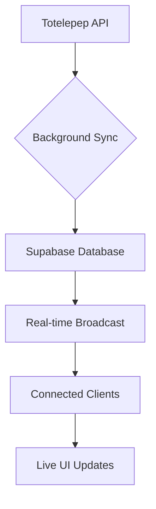

# Totelepep PWA - Live Sports Betting Data Extractor

A Progressive Web App that extracts real-time sports betting data from totelepep.mu using Power Query logic.

## Features

### 🚀 Core Functionality
- **Real-time Data Extraction**: Scrapes live betting data from totelepep.mu
- **Power Query Logic**: Replicates Excel Power Query extraction methods
- **Multiple Extraction Methods**: HTML tables, div containers, and JavaScript data
- **Smart Parsing**: Identifies team names, odds, times, and leagues automatically

### 📱 PWA Features
- **Offline Support**: Works without internet connection using cached data
- **Installable**: Can be installed as a native app on mobile and desktop
- **Background Sync**: Updates data in the background when online
- **Push Notifications**: Alerts for new matches and updates
- **Responsive Design**: Optimized for all screen sizes

### ⚡ Real-time Synchronization (NEW)
- **Live Odds Updates**: Real-time synchronization with Supabase for instant odds updates
- **Background Auto-sync**: Automatically updates every 2 minutes
- **Real-time Broadcasting**: Instant updates to all connected clients
- **Efficient Data Management**: Automatic cleanup of old data

### ⚽ Betting Features
- **Live Odds**: 1X2, Over/Under, Both Teams to Score
- **Parlay Builder**: Create multi-selection bets with automatic odds calculation
- **Match Filtering**: Search by team names or leagues
- **Date Grouping**: Matches organized by date for easy browsing
- **Live Updates**: Real-time score and odds updates

## Technical Implementation

### Data Extraction Strategy

The app uses a multi-layered extraction approach:

1. **HTML Table Parsing**
   ```typescript
   // Extracts from <table> elements
   const tableRegex = /<table[^>]*>(.*?)<\/table>/gis;
   const rowRegex = /<tr[^>]*>(.*?)<\/tr>/gis;
   ```

2. **Div Container Analysis**
   ```typescript
   // Looks for match-related CSS classes
   /<div[^>]*class="[^"]*match[^"]*"[^>]*>/gis
   ```

3. **JavaScript Data Mining**
   ```typescript
   // Extracts from embedded JS variables
   /var\s+matches\s*=\s*(\[.*?\]);/s
   /window\.matchData\s*=\s*(\[.*?\]);/s
   ```

### CORS Handling

Since direct browser requests to external sites face CORS restrictions, the app uses a proxy configuration:

```typescript
// vite.config.ts
server: {
  proxy: {
    '/api': {
      target: 'https://www.totelepep.mu',
      changeOrigin: true,
      rewrite: (path) => path.replace(/^\/api/, '')
    }
  }
}
```

### Rate Limiting & Caching

```typescript
private rateLimitDelay = 2000; // 2 seconds between requests
private cacheTimeout = 5 * 60 * 1000; // 5 minutes cache
```

## Real-time Synchronization System

### Architecture Overview



### Benefits

- **Live Odds Access**: Get real-time updates on match odds as they change
- **Reduced Latency**: Instant updates without manual refresh
- **Better User Experience**: Users see live data without delays
- **Efficient Data Management**: Automatic cleanup of old data

### Setup Instructions

See [REALTIME_SYNC_SETUP.md](REALTIME_SYNC_SETUP.md) for detailed setup instructions.

## Installation & Setup

### Prerequisites
- Node.js 18+ 
- npm or yarn

### Development Setup

1. **Clone and Install**
   ```bash
   git clone <repository>
   cd totelepep-pwa
   npm install
   ```

2. **Configure Real-time Sync (Optional but Recommended)**
   - Create a Supabase account at [supabase.com](https://supabase.com)
   - Create a new project
   - Set up the database schema using `supabase_schema.sql`
   - Create a `.env` file with your Supabase credentials:
     ```env
     VITE_SUPABASE_URL=your_supabase_project_url
     VITE_SUPABASE_ANON_KEY=your_supabase_anon_key
     ```

3. **Start Development Server**
   ```bash
   npm run dev
   ```

4. **Access the App**
   - Open http://localhost:5173
   - The proxy will handle requests to totelepep.mu

### Production Deployment

1. **Build the App**
   ```bash
   npm run build
   ```

2. **Deploy Static Files**
   - Upload `dist/` folder to your web server
   - Ensure your server can proxy requests to totelepep.mu

3. **Server Configuration**
   
   **Nginx Example:**
   ```nginx
   location /api/ {
     proxy_pass https://www.totelepep.mu/;
     proxy_set_header Host www.totelepep.mu;
     proxy_set_header X-Real-IP $remote_addr;
     add_header Access-Control-Allow-Origin *;
   }
   ```

   **Apache Example:**
   ```apache
   ProxyPass /api/ https://www.totelepep.mu/
   ProxyPassReverse /api/ https://www.totelepep.mu/
   Header always set Access-Control-Allow-Origin "*"
   ```

## Usage Guide

### Basic Usage

1. **Automatic Data Loading**
   - App automatically fetches data on startup
   - Auto-refreshes every 5 minutes when online

2. **Manual Data Extraction**
   - Click "Show Data Extractor" button
   - Click "Extract from Totelepep" to manually fetch data
   - Watch real-time extraction progress

3. **Building Parlays**
   - Click on any odds to add to parlay
   - Adjust stake amount (minimum MUR 50)
   - View potential payout calculations
   - Place bets with confirmation

### Advanced Features

1. **Offline Mode**
   - App works offline using cached data
   - Service worker handles background updates
   - Offline indicator shows connection status

2. **PWA Installation**
   - Install prompt appears automatically
   - Add to home screen on mobile
   - Works like native app when installed

3. **Search & Filter**
   - Search by team names or leagues
   - Results update in real-time
   - Maintains date grouping

## Data Structure

### Match Object
```typescript
interface TotelepepMatch {
  id: string;
  homeTeam: string;
  awayTeam: string;
  league: string;
  kickoff: string;
  date: string;
  status: 'upcoming' | 'live' | 'finished';
  homeOdds: number;
  drawOdds: number;
  awayOdds: number;
  overUnder: {
    over: number;
    under: number;
    line: number;
  };
  bothTeamsScore: {
    yes: number;
    no: number;
  };
  homeScore?: number;
  awayScore?: number;
  minute?: number;
}
```

## Compliance & Ethics

### Rate Limiting
- 2-second delay between requests
- Respects server resources
- Implements exponential backoff on errors

### Caching Strategy
- 5-minute cache to reduce server load
- Offline-first approach
- Background sync when possible

### Legal Considerations
- Check totelepep.mu robots.txt
- Respect terms of service
- Use data responsibly
- Consider reaching out for API access

## Troubleshooting

### Common Issues

1. **No Data Loading**
   - Check if totelepep.mu is accessible
   - Verify proxy configuration
   - Try manual data extraction

2. **CORS Errors**
   - Ensure proxy is configured correctly
   - Check server headers
   - Verify target URL is correct

3. **Extraction Failures**
   - Website structure may have changed
   - Update extraction patterns
   - Check browser console for errors

### Debug Mode

Enable detailed logging:
```typescript
// In browser console
localStorage.setItem('debug', 'true');
```

## Performance Optimization

### Bundle Size
- Tree-shaking enabled
- Code splitting by routes
- Lazy loading of components

### Caching Strategy
- Service worker caches static assets
- API responses cached for 5 minutes
- Background sync for updates

### Network Efficiency
- Compression enabled
- Minimal API calls
- Efficient data structures

## Contributing

1. Fork the repository
2. Create feature branch
3. Implement changes with tests
4. Submit pull request

## License

This project is for educational purposes. Ensure compliance with totelepep.mu terms of service before commercial use.

## Support

For issues or questions:
1. Check the troubleshooting section
2. Review browser console logs
3. Verify network connectivity
4. Test with manual extraction

---

**Note**: This app demonstrates web scraping techniques for educational purposes. Always respect website terms of service and consider official APIs when available.