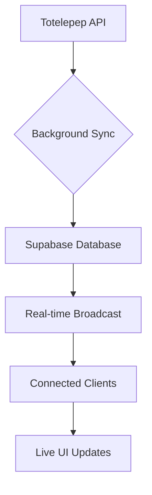

# Real-time Synchronization Setup Guide

This guide explains how to set up real-time synchronization between Totelepep and Supabase for live access to match odds.

## Prerequisites

1. A Supabase account (free tier available at [supabase.com](https://supabase.com))
2. Node.js and npm installed

## Setup Instructions

### 1. Create a Supabase Project

1. Go to [supabase.com](https://supabase.com) and sign up or log in
2. Create a new project
3. Note down your:
   - Project URL (e.g., `https://your-project.supabase.co`)
   - anon/public key (found in Settings > API)

### 2. Set Up the Database Schema

1. In your Supabase project, go to the SQL Editor
2. Copy and paste the contents of `supabase_schema.sql` into the editor
3. Run the SQL to create the matches table and indexes
4. This will also set up real-time subscriptions for the matches table

### 3. Configure Environment Variables

Create a `.env` file in your project root with the following:

```env
VITE_SUPABASE_URL=your_supabase_project_url
VITE_SUPABASE_ANON_KEY=your_supabase_anon_key
```

Replace the values with your actual Supabase credentials.

### 4. How Real-time Synchronization Works

The real-time synchronization system works as follows:

1. **Background Sync**: Every 2 minutes, the system automatically fetches fresh data from Totelepep and stores it in Supabase
2. **Real-time Updates**: Supabase broadcasts changes to all connected clients in real-time
3. **Live Data Access**: The app receives real-time updates and can refresh the UI instantly
4. **Data Cleanup**: Old matches (older than 7 days) are automatically cleaned up to keep the database efficient

### 5. Benefits

- **Live Odds Access**: Get real-time updates on match odds as they change
- **Reduced Latency**: Instant updates without manual refresh
- **Better User Experience**: Users see live data without delays
- **Efficient Data Management**: Automatic cleanup of old data

### 6. Monitoring

You can monitor the real-time sync status through the console logs:
- `📡 Sync service availability: Available` - Real-time sync is working
- `🔄 Starting data sync from Totelepep to Supabase...` - Background sync in progress
- `✅ Successfully synced X matches to Supabase` - Sync completed successfully
- `📥 Received real-time match update:` - Real-time update received

### 7. Troubleshooting

If you encounter issues:

1. **Check Environment Variables**: Ensure `VITE_SUPABASE_URL` and `VITE_SUPABASE_ANON_KEY` are correctly set
2. **Verify Database Schema**: Make sure the matches table exists with the correct structure
3. **Check Network Connectivity**: Ensure your application can reach Supabase
4. **Review Console Logs**: Look for error messages in the browser console
5. **Verify Real-time Setup**: Check that the matches table is added to the `supabase_realtime` publication

### 8. Customization

You can adjust the synchronization behavior by modifying the real-time sync service:

- **Sync Interval**: Change the interval in `realTimeSyncService.ts` (currently 2 minutes)
- **Data Retention**: Modify the cleanup period in `supabaseService.ts` (currently 7 days)
- **Real-time Events**: Customize which events trigger updates in `supabaseService.ts`

## Architecture Overview



The system provides both periodic background sync and real-time updates for the best possible user experience.

## Testing Real-time Updates

To test real-time updates:

1. Open the app in multiple browser tabs
2. Make changes to match data in Supabase (e.g., through the Supabase dashboard)
3. Observe that all tabs receive the updates instantly
4. Check the browser console for `📥 Received real-time match update:` messages

## Performance Considerations

- **Bandwidth**: Real-time updates use WebSocket connections which are more efficient than polling
- **Database Load**: Background sync runs every 2 minutes to minimize load on Totelepep servers
- **Client Resources**: Real-time updates are lightweight and don't impact client performance